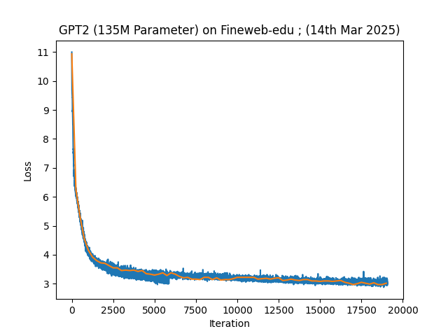
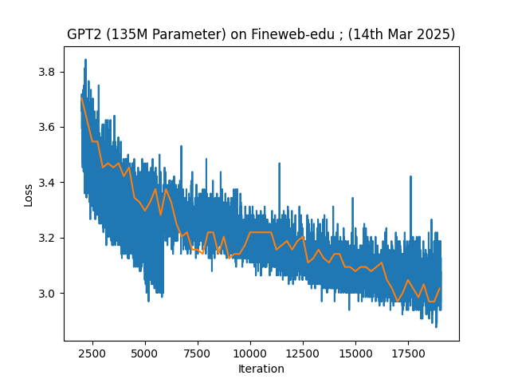

# JaxPT
GPT models built with JAX

## Getting Started 

This project implements the GPT series of models using Jax and Flax's NNX library.

### Requirements

Install the UV python package managment library

`curl -LsSf https://astral.sh/uv/install.sh | sh`

### Available Commands

The main commands available in the Makefile are:

- `make install` - Install dependencies from lockfile
- `make dev` - Install all dependencies including dev from lockfile
- `make clean` - Clean build artifacts and cache
- `make build` - Build package
- `make lint` - Run linting
- `make format` - Format code
- `make lab` - Run Jupyter lab server from the project directory

To see all available commands and their descriptions, run: `make help`

### Training

The training run can be reproduced using `notebooks/train_gpt2.ipynb`
A machine with 8 x Nvidia A100 80GB GPUs used to train for 1 epoch on a 10bn token sample of the 
Fineweb-Edu dataset. Validation was performed on 1% of the dataset. 
The trained model was evaluated on the Hellaswag benchmark.

### Results

The trained model achieved a score of 0.3025 on the Hellaswag benchmark.

## Available Models

This project includes a variety of transformer-based language models with different architectures and optimizations:

### Core GPT Models
- **GPT** - Standard GPT-2 style transformer with causal self-attention and MLP layers
- **VGPT** - Variant of GPT with similar architecture but different initialization and configuration
- **NoPE_GPT** - GPT model without positional embeddings, for experiments on sequence modeling

### Enhanced GPT Variants
- **GLU_GPT** - GPT with Gated Linear Units (GLU) in the MLP layers for improved efficiency
- **RoPE_GPT** - GPT incorporating Rotary Position Embeddings (RoPE) for better positional encoding
- **GLU_RoPE_GPT** - Combines GLU activation with RoPE for enhanced performance

### Grouped Query Attention (GQA) Models
- **GQA_GPT** - GPT with Grouped Query Attention for reduced memory usage during inference
- **GQA_GLU_RoPE_GPT** - Advanced variant combining GQA, GLU, and RoPE for optimal efficiency

### Mixture of Experts (MoE) Models
- **Tiny_MoE** - Compact Mixture of Experts model with alternating MoE and GLU blocks, includes load balancing losses
- **Tiny_MoE_2** - Fully MoE-based architecture with uniform expert layers and auxiliary loss coefficients
- **Tiny_MoE_3** - Uses Soft MoE routing mechanism with alternating MoE and GLU block structure

### Specialized Models
- **SmolLM** - Lightweight language model inspired by small LLaMA variants with RMSNorm and efficient attention
- **Charformer** - Character-level transformer model designed for text generation at character granularity
- **Bigram** - Simple bigram language model for baseline comparisons and educational purposes

## Detailed Technical Specifications

### Core GPT Models

#### **GPT**
- **Precision**: float32 (dtype & param_dtype)
- **Sharding**: Manual partition specs (FSDP-like) for embed, pos_embed, ln, mlp, attn layers
- **Attention**: CausalSelfAttention with XLA/CUDNN SDPA implementation
- **Activation**: Standard MLP (no explicit activation specified)
- **Positional**: Learnable positional embeddings
- **Normalization**: LayerNorm with epsilon 1e-5

#### **VGPT**
- **Precision**: float32 (dtype & param_dtype)
- **Sharding**: Manual partition specs (identical to GPT)
- **Attention**: CausalSelfAttention with XLA/CUDNN SDPA implementation
- **Activation**: Standard MLP
- **Positional**: Learnable positional embeddings
- **Special**: Compatible with VGPT2 HuggingFace checkpoints

#### **NoPE_GPT**
- **Precision**: float32
- **Sharding**: No explicit sharding specifications
- **Attention**: CausalSelfAttention with XLA implementation
- **Activation**: Standard MLP with ReLU
- **Positional**: None (no positional embeddings)
- **Purpose**: Baseline model for positional encoding ablation studies

### Enhanced GPT Variants

#### **GLU_GPT**
- **Precision**: float32 (dtype & param_dtype)
- **Sharding**: Manual partition specs for GLU components (glu_fc, glu_gate, glu_proj)
- **Attention**: CausalSelfAttention (no RoPE)
- **Activation**: SiLU (default), supports GELU, Sigmoid
- **Positional**: Learnable positional embeddings
- **MLP**: Gated Linear Unit (GLU) architecture

#### **RoPE_GPT**
- **Precision**: float32 (dtype & param_dtype)
- **Sharding**: Manual partition specs for all components
- **Attention**: CausalSelfAttention_w_RoPE with theta=1e-4
- **Activation**: Standard MLP
- **Positional**: Rotary Position Embeddings (RoPE) using Llama-style calculation
- **Special**: Pre-calculated RoPE thetas for efficiency

#### **GLU_RoPE_GPT**
- **Precision**: float32 (dtype & param_dtype)
- **Sharding**: Manual partition specs for GLU + RoPE components
- **Attention**: CausalSelfAttention_w_RoPE with theta=1e-4
- **Activation**: SiLU (default), supports GELU, Sigmoid
- **Positional**: Rotary Position Embeddings
- **MLP**: Gated Linear Unit with RoPE integration

### Grouped Query Attention (GQA) Models

#### **GQA_GPT**
- **Precision**: float32 (dtype & param_dtype)
- **Sharding**: Manual partition specs for GQA components (wq, wkv, wproj)
- **Attention**: Grouped Query Attention (9 query heads, 3 KV heads = 3:1 ratio)
- **Activation**: Standard MLP
- **Positional**: Learnable positional embeddings
- **Memory**: KV caching support (use_cache=False default)
- **Optimization**: 3x reduction in KV cache memory vs full attention

#### **GQA_GLU_RoPE_GPT**
- **Precision**: float32 (dtype & param_dtype)
- **Sharding**: Manual partition specs for GQA + GLU components
- **Attention**: Grouped Query Attention with RoPE (12 query, 4 KV heads = 3:1 ratio)
- **Activation**: SiLU (default), supports GELU, Sigmoid
- **Positional**: Rotary Position Embeddings with theta=1e-4
- **Memory**: KV caching support
- **MLP**: Gated Linear Unit
- **Efficiency**: Combines GQA memory savings with RoPE performance

### Mixture of Experts (MoE) Models

#### **Tiny_MoE**
- **Precision**: bfloat16 (computation), float32 (parameters)
- **Sharding**: Manual partition specs + device mesh support
- **Attention**: GQ_Attention_w_RoPE (12 query, 4 KV heads)
- **Architecture**: Alternating MoE and GLU blocks (50% each)
- **MoE Configuration**: 8 experts, top-k=2, load factor=1.1
- **Activation**: SiLU
- **Normalization**: RMSNorm (epsilon 1e-6)
- **Losses**: Load balancing (1e-2) + Z-loss (1e-3)
- **Routing**: Expert weight priority enabled
- **Positional**: RoPE with theta=1e-4

#### **Tiny_MoE_2**
- **Precision**: bfloat16 (computation), float32 (parameters)
- **Sharding**: Manual partition specs for MoE components
- **Attention**: GQ_Attention_w_RoPE (12 query, 4 KV heads)
- **Architecture**: Fully MoE (all layers use MoE, no GLU blocks)
- **MoE Configuration**: 8 experts, top-k=2, load factor=1.25
- **Activation**: SiLU
- **Normalization**: RMSNorm (epsilon 1e-5)
- **Losses**: Load balancing (1e-2) + Z-loss (1e-4)
- **Routing**: No expert weight priority
- **Positional**: RoPE with theta=1e-4

#### **Tiny_MoE_3**
- **Precision**: bfloat16 (computation), float32 (parameters)
- **Sharding**: Manual partition specs
- **Attention**: GQ_Attention_w_RoPE (12 query, 4 KV heads)
- **Architecture**: Alternating Soft MoE and GLU blocks
- **MoE Configuration**: 8 experts using Soft MoE routing
- **Activation**: SiLU
- **Normalization**: RMSNorm (epsilon 1e-6)
- **Routing**: Soft MoE (no auxiliary losses)
- **Positional**: RoPE with theta=1e-4
- **Special**: Uses differentiable Soft MoE instead of hard routing

### Specialized Models

#### **SmolLM**
- **Precision**: float32
- **Sharding**: Manual partition specs + device mesh support
- **Attention**: GQ_Attention_w_RoPE (9 query, 3 KV heads = 3:1 ratio)
- **Activation**: SiLU (default), supports GELU, Sigmoid
- **Positional**: RoPE with theta=1e-4
- **MLP**: Gated Linear Unit
- **Normalization**: RMSNorm (epsilon 1e-5)
- **Memory**: KV caching support
- **Integration**: HuggingFace SmoL LM checkpoint loading/conversion
- **Architecture**: LLaMA-style compact design

#### **Charformer**
- **Precision**: bfloat16 (hardcoded)
- **Sharding**: 2D data/model parallel mesh (DATA_DIMS=2, MODEL_DIMS=4)
- **Attention**: Flash Attention via Pallas TPU ops
- **Activation**: ReLU in MLP
- **Positional**: Learnable positional embeddings
- **Normalization**: LayerNorm
- **Memory**: KV caching with sequence masking
- **Special**: Character-level processing, TPU-optimized
- **Scale**: 30 layers, 960 embed dim, 15 heads

#### **Bigram**
- **Precision**: float32 (default)
- **Sharding**: None (single device)
- **Attention**: None (simple lookup model)
- **Activation**: None
- **Architecture**: Simple bigram language model
- **Purpose**: Baseline comparison, educational tool
- **Complexity**: Minimal computational overhead

### Key Features
- All models support JAX/Flax NNX framework
- Multiple precision modes (float32, bfloat16, mixed precision)
- Various sharding strategies (manual FSDP-like, device mesh, data/model parallel)
- Advanced attention mechanisms (causal, grouped query, RoPE-enhanced, flash attention)
- Multiple activation functions (GELU, SiLU, Sigmoid, ReLU)
- Different normalization approaches (LayerNorm, RMSNorm)
- KV caching for efficient inference
- Comprehensive checkpoint management
- HuggingFace integration for select models

